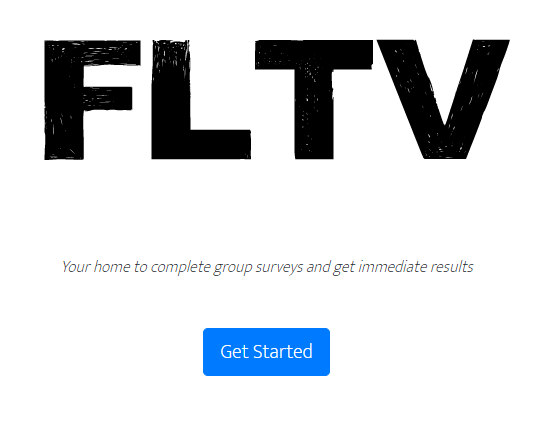
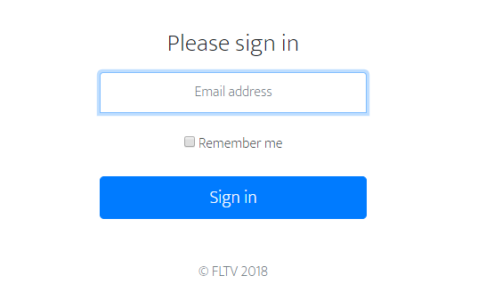
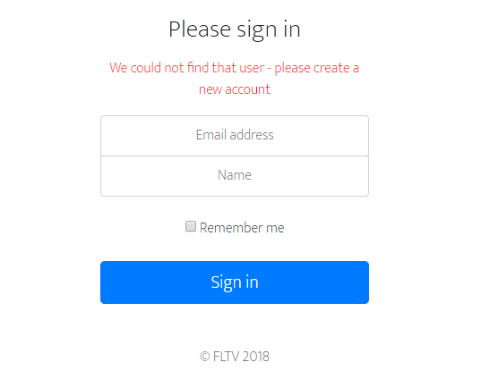
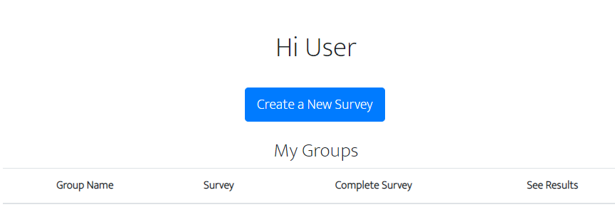
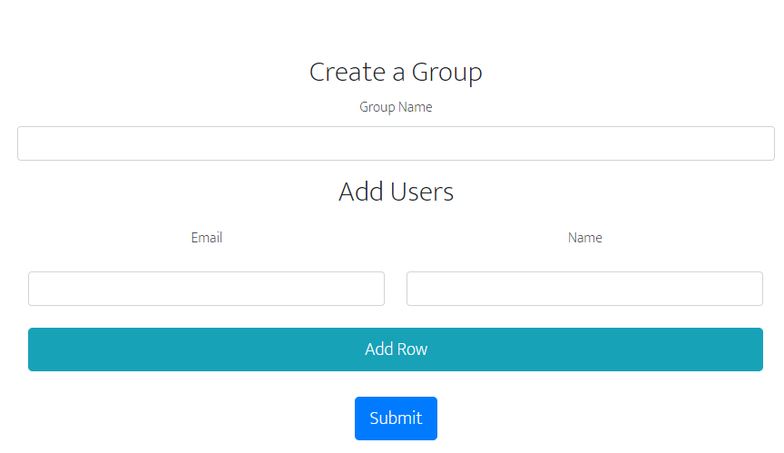
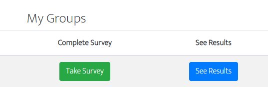
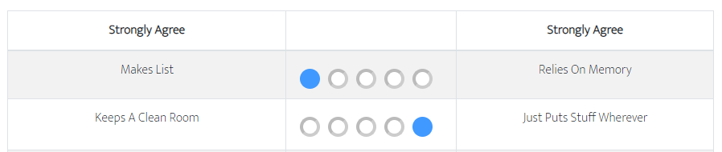

## FLTV
_A group oriented application designed to allow for surveys, namely but not limited to personality testing. For this instance, the testing survey is built off the [Open Extended Jungian Type Scale](https://openpsychometrics.org/tests/OEJTS/development/), an open source substitute to the Myers-Briggs Type Indicator, to show it's complete capabilities._

[**Live Demo**](https://serene-taiga-32891.herokuapp.com/) hosted on [Heroku](https://heroku.com/)

FLTV's objective is to allow the user to:
1. Create their own account to login
2. Take or create their own survey, allowing them to add a group name and specific users
3. View results of the survey taken

### Usage
Upon visiting the application, the user is shown the home page.

Once "Get Started" is clicked, the user is directed to a login page.

If they have not already created an account, they will be prompted to do so.

After they have sucessfully created an account or logged in, the user is redirected the dashboard.

From here they can create, take or view previous results of a survey they've taken.

If they choose to click "Create A New Survey", they are presented with a screen to make the required adjustments to do so.

The creation of the survey will show up on the dashboard and allow the user to select it.

For testing purposes, a personality survey was created. Once clicked, this user would be presented with this screen.

### Resources used
* [NodeJS](https://nodejs.org/en/)
* [ExpressJS](https://expressjs.com/)
* [HandlebarsJS](https://handlebarsjs.com/)
* [Google Fonts](https://fonts.google.com/)
* [MySQL](https://www.mysql.com/)
* [Bootstrap](https://getbootstrap.com/)
* [Sequelize](http://docs.sequelizejs.com/)
* [Express Session Module](https://www.npmjs.com/package/express-session)
* [jQuery](https://jquery.com/)
* [Font Awesome](https://fontawesome.com/)
* [Keep Singing Font](https://www.1001fonts.com/keep-singing-font.html)
* [Twemoji](https://github.com/twitter/twemoji)